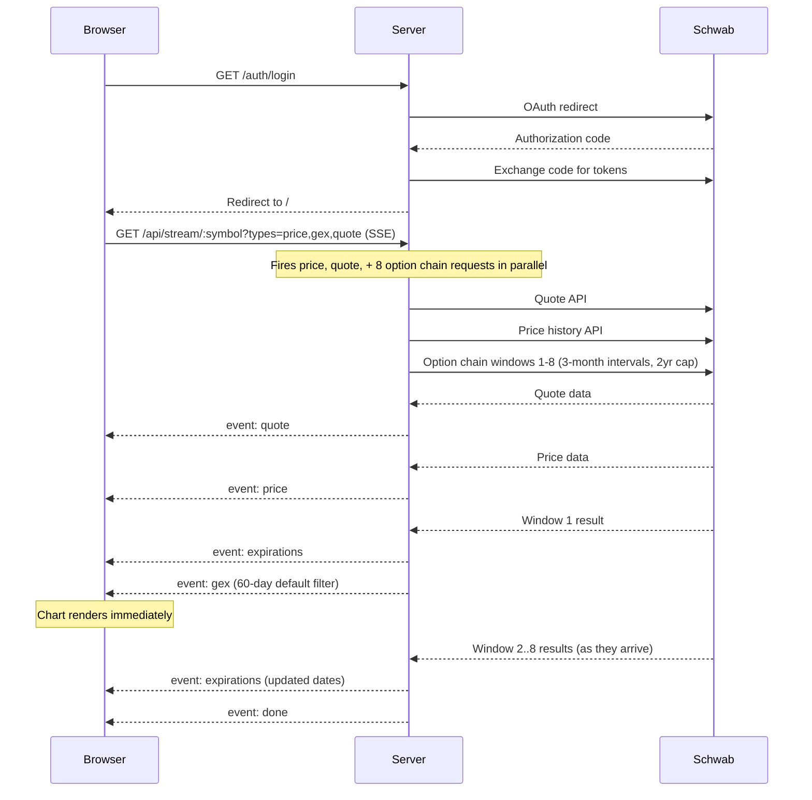

# GEX Dash

Real-time Gamma Exposure (GEX) visualization for equities and index options, powered by the Schwab API. Renders candlestick price charts alongside call/put GEX bars and per-strike options volume using Three.js.

## Architecture

```
src/
├── server.ts              # Express setup, route registration, HTTPS bootstrap
├── certs.ts               # Self-signed TLS certificate generation
├── schwab.ts              # Schwab OAuth, token persistence, API fetch functions (quote, price, chains)
├── gex.ts                 # GEX calculation engine
├── routes/
│   ├── auth.ts            # /auth/login, /auth/callback, /auth/status
│   ├── stream.ts          # GET /api/stream/:symbol (SSE, unified price + GEX)
│   └── watchlist.ts       # GET/POST/DELETE /api/watchlist (persisted to watchlist.json)
└── public/
    ├── index.html         # HTML shell
    ├── css/styles.css     # All styles
    └── js/
        ├── main.js        # Entry point, app state, event wiring
        ├── api.js         # API calls, SSE stream via EventSource
        ├── expDialog.js       # Expiration filter dialog
        ├── watchlistDialog.js # Watchlist dialog
        └── chart/
            ├── constants.js   # Colors, layout, frequency/range maps
            ├── GEXChart.js    # Core chart class (Three.js scene, coordinates)
            ├── renderers.js   # Candle, GEX bar, volume bar, grid rendering
            ├── interaction.js # Drag, zoom, crosshair, tooltip, bar highlight
            └── labels.js      # DOM label overlays (price, dates, GEX/volume scales)
```

### Data Flow



### GEX Calculation

For each option contract in the chain:

```
Call GEX = |gamma| * openInterest * 100 * spotPrice
Put  GEX = |gamma| * openInterest * 100 * spotPrice * -1
Net  GEX = Call GEX + Put GEX
```

GEX is aggregated per strike price across all selected expiration dates. Total options volume and open interest are also aggregated per strike. Positive net GEX at a strike implies dealer hedging activity that dampens price movement (a "pin"), while negative net GEX implies amplification. Strikes where volume exceeds open interest are flagged with an orange dot.

### SSE Streaming

The `/api/stream/:symbol` endpoint uses **Server-Sent Events** with a `types` query param to control what data is streamed:

- **`types=price,gex,quote`** (initial symbol load): price history, quote, and all option chain windows are fetched in parallel. Events are sent as data resolves: `event: price` for candles, `event: quote` for current price/change, `event: expirations` for available dates, `event: gex` for GEX levels (60-day default filter), then `event: done`.
- **`types=price`** (freq/range change): fetches only price history, sends `event: price` + `event: done`.
- **`types=gex,quote&expirations=...`** (custom filter): fetches option chains and quote in parallel, sends `event: quote` + `event: expirations` + `event: gex` + `event: done`.

The `quote` event is fetched via Schwab's dedicated `/quotes` endpoint (lightweight, no option chain needed) and carries `{ price, change, percentChange }`. The `gex` event includes `selectedExpirations` so the client knows exactly which dates were used in the calculation.

### Chart


## Chart Interactions

| Area | Action | Behavior |
|------|--------|----------|
| Candle chart | Click + drag | Pan horizontally through time (Y auto-fits) |
| Candle chart | Double-click | Reset to full data range |
| Price axis | Click + drag up/down | Zoom price scale around click point |
| Price axis | Double-click | Reset to auto-fit Y |
| X-axis (date labels) | Click + drag left/right | Zoom time scale around click point |
| Anywhere | Crosshair hover | Tooltip on GEX section shows nearest strike's call/put/net GEX, volume, and OI; hovered bars glow |

All axis zooms anchor to the position where you clicked, so the point under your cursor stays fixed while the scale expands or contracts around it.

## Prerequisites

- **Node.js** >= 18
- A **Schwab Developer** account with an app registered at [developer.schwab.com](https://developer.schwab.com)
- Your app's callback URL must include `https://127.0.0.1:3000/auth/callback` (or your custom PORT)

## Setup

```bash
# Install dependencies
npm install

# Configure environment
cp .env.example .env
# Edit .env with your Schwab API credentials:
#   SCHWAB_CLIENT_ID=your-app-key
#   SCHWAB_CLIENT_SECRET=your-app-secret
#   PORT=3000  (optional)
```

## Running

```bash
# Development (auto-reload)
npm run dev

# Production
npm run build
npm start
```

The server starts at `https://127.0.0.1:3000`. On first run, a self-signed TLS certificate is generated in `certs/`. Your browser will show a security warning -- proceed through it.

1. Click **Connect with Schwab** to authenticate.
2. After OAuth redirect, the app loads AAPL by default.
3. Enter any symbol in the search box and press Enter or click Load.
4. Click **Watchlist** to save symbols for quick access.

## API Endpoints

| Endpoint | Method | Description |
|----------|--------|-------------|
| `/auth/login` | GET | Initiates Schwab OAuth flow |
| `/auth/callback` | GET | OAuth callback handler |
| `/auth/status` | GET | Returns `{ authenticated: boolean }` |
| `/api/stream/:symbol` | GET | SSE endpoint. Required: `types` (comma-separated: `price`, `gex`, `quote`). Optional: `frequencyType`, `frequency`, `periodType`, `period` (price params), `expirations` (comma-separated dates for GEX filter) |
| `/api/watchlist` | GET | Returns saved watchlist symbols as JSON array |
| `/api/watchlist/:symbol` | POST | Adds a symbol to the watchlist |
| `/api/watchlist/:symbol` | DELETE | Removes a symbol from the watchlist |

## Expiration Filter

The Expirations button in the header opens a multi-select dialog for filtering which option expiration dates are included in the GEX calculation:

- **Default**: Expirations within 60 days are selected.
- **All dates**: Available up to 2 years out, streamed progressively as Schwab windows resolve.
- Applying a custom filter re-fetches GEX with only the selected expirations.

## Watchlist

The Watchlist button (beside Load) opens a dialog for saving frequently used symbols:

- **Add**: Type a symbol and press Enter or click **+** to save it.
- **Load**: Click any symbol in the list to load its chart immediately.
- **Remove**: Click the **×** next to a symbol to delete it.

Symbols are persisted in `watchlist.json` at the project root (gitignored). The file is created automatically on first use.

## Tech Stack

- **Server**: Express + HTTPS (self-signed certs), TypeScript, `@sudowealth/schwab-api` for OAuth, SSE streaming
- **Frontend**: Vanilla JS ES modules, Three.js (WebGL orthographic renderer), native EventSource API, no build step
- **API**: Schwab Market Data v1 (quotes, option chains, price history)
