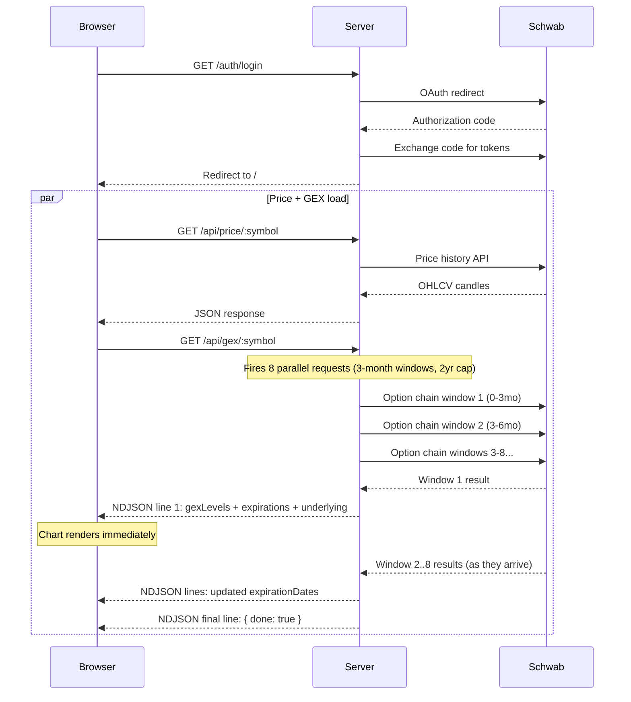
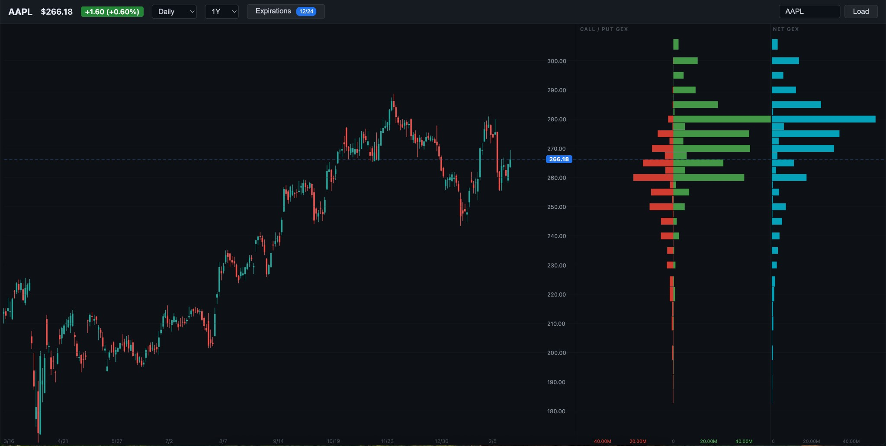

# GEX Dash

Real-time Gamma Exposure (GEX) visualization for equities and index options, powered by the Schwab API. Renders candlestick price charts alongside call/put and net GEX bar charts using Three.js.

## Architecture

```
src/
├── server.ts              # Express setup, route registration, HTTPS bootstrap
├── certs.ts               # Self-signed TLS certificate generation
├── schwab.ts              # Schwab OAuth, token persistence, API fetch functions
├── gex.ts                 # GEX calculation engine
├── routes/
│   ├── auth.ts            # /auth/login, /auth/callback, /auth/status
│   ├── price.ts           # GET /api/price/:symbol
│   └── gex.ts             # GET /api/gex/:symbol (streaming + filtered)
└── public/
    ├── index.html         # HTML shell
    ├── css/styles.css     # All styles
    └── js/
        ├── main.js        # Entry point, app state, event wiring
        ├── api.js         # API calls, NDJSON stream reader
        ├── expDialog.js   # Expiration filter dialog
        └── chart/
            ├── constants.js   # Colors, layout, frequency/range maps
            ├── GEXChart.js    # Core chart class (Three.js scene, coordinates)
            ├── renderers.js   # Candle, GEX bar, grid rendering
            ├── interaction.js # Drag, zoom, crosshair, tooltip
            └── labels.js      # DOM label overlays
```

### Data Flow



### GEX Calculation

For each option contract in the chain:

```
Call GEX = |gamma| * openInterest * 100 * spotPrice
Put  GEX = |gamma| * openInterest * 100 * spotPrice * -1
Net  GEX = Call GEX + Put GEX
```

GEX is aggregated per strike price across all selected expiration dates. Positive net GEX at a strike implies dealer hedging activity that dampens price movement (a "pin"), while negative net GEX implies amplification.

### Streaming Response

The `/api/gex/:symbol` endpoint uses **NDJSON streaming** (newline-delimited JSON) for the default load path:

1. All 8 Schwab option chain windows (3-month intervals, 2-year cap) are fired in parallel.
2. The first window (0-3mo) is awaited and sent immediately with GEX levels computed for the default 60-day expiration filter.
3. Remaining windows stream only new expiration dates as they resolve, updating the filter UI.
4. When `?expirations=` is provided (user applied a custom filter), the endpoint falls back to a standard JSON response.

### Chart



## Chart Interactions

| Area | Action | Behavior |
|------|--------|----------|
| Candle chart | Click + drag | Pan horizontally through time (Y auto-fits) |
| Candle chart | Double-click | Reset to full data range |
| Price axis | Click + drag up/down | Zoom price scale around click point |
| Price axis | Double-click | Reset to auto-fit Y |
| X-axis (date labels) | Click + drag left/right | Zoom time scale around click point |

All axis zooms anchor to the position where you clicked, so the point under your cursor stays fixed while the scale expands or contracts around it.

## Prerequisites

- **Node.js** >= 18
- A **Schwab Developer** account with an app registered at [developer.schwab.com](https://developer.schwab.com)
- Your app's callback URL must include `https://127.0.0.1:3000/auth/callback` (or your custom PORT)

## Setup

```bash
# Install dependencies
npm install

# Configure environment
cp .env.example .env
# Edit .env with your Schwab API credentials:
#   SCHWAB_CLIENT_ID=your-app-key
#   SCHWAB_CLIENT_SECRET=your-app-secret
#   PORT=3000  (optional)
```

## Running

```bash
# Development (auto-reload)
npm run dev

# Production
npm run build
npm start
```

The server starts at `https://127.0.0.1:3000`. On first run, a self-signed TLS certificate is generated in `certs/`. Your browser will show a security warning -- proceed through it.

1. Click **Connect with Schwab** to authenticate.
2. After OAuth redirect, the app loads AAPL by default.
3. Enter any symbol in the search box and press Enter or click Load.

## API Endpoints

| Endpoint | Method | Description |
|----------|--------|-------------|
| `/auth/login` | GET | Initiates Schwab OAuth flow |
| `/auth/callback` | GET | OAuth callback handler |
| `/auth/status` | GET | Returns `{ authenticated: boolean }` |
| `/api/price/:symbol` | GET | Proxies Schwab price history. Query params: `frequencyType`, `frequency`, `periodType`, `period` |
| `/api/gex/:symbol` | GET | Streams GEX data as NDJSON. Optional query param: `expirations` (comma-separated dates like `2025-03-21,2025-04-17`) |

## Expiration Filter

The Expirations button in the header opens a multi-select dialog for filtering which option expiration dates are included in the GEX calculation:

- **Default**: Expirations within 60 days are selected.
- **All dates**: Available up to 2 years out, streamed progressively as Schwab windows resolve.
- Applying a custom filter re-fetches GEX with only the selected expirations.

## Tech Stack

- **Server**: Express + HTTPS (self-signed certs), TypeScript, `@sudowealth/schwab-api` for OAuth
- **Frontend**: Vanilla JS ES modules, Three.js (WebGL orthographic renderer), no build step
- **API**: Schwab Market Data v1 (option chains, price history)
