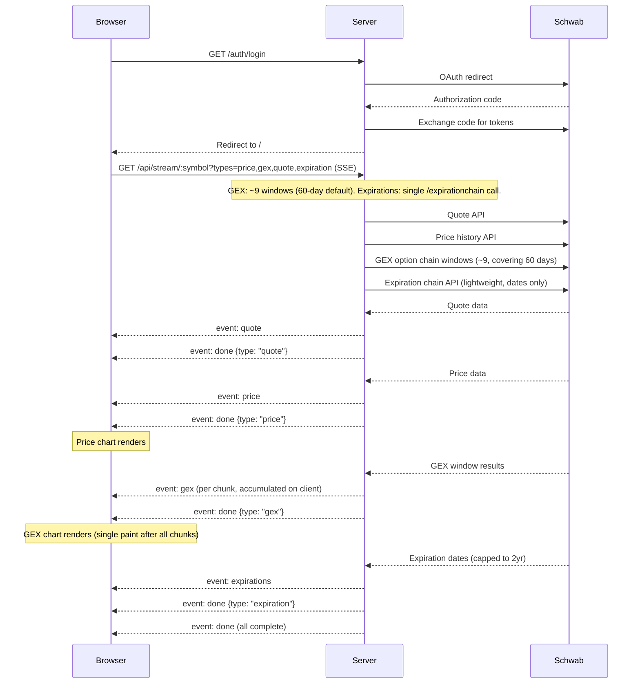

# GEX Dash

Real-time Gamma Exposure (GEX) visualization for equities and index options, powered by the Schwab API. Renders candlestick price charts alongside call/put GEX bars and per-strike options volume using Three.js.

## Architecture

```
src/
├── server.ts              # Express setup, JSON body parsing, route registration, HTTPS bootstrap
├── certs.ts               # Self-signed TLS certificate generation
├── schwab.ts              # Schwab OAuth, token persistence, API fetch functions (quote, price, chains)
├── gex.ts                 # GEX calculation engine
├── routes/
│   ├── auth.ts            # /auth/login, /auth/callback, /auth/status
│   ├── stream.ts          # GET /api/stream/:symbol (SSE, unified price + GEX)
│   └── watchlist.ts       # GET/PUT /api/watchlist, POST/DELETE /api/watchlist/:section/:symbol
└── public/
    ├── index.html         # HTML shell
    ├── css/styles.css     # All styles
    └── js/
        ├── main.js        # Entry point, app state, event wiring
        ├── api.js         # API calls, SSE stream via EventSource
        ├── expDialog.js       # Expiration filter dialog
        ├── watchlist.js       # Watchlist sidebar (sections, quotes, drag-to-reorder)
        └── chart/
            ├── constants.js   # Colors, layout, frequency/range maps
            ├── GEXChart.js    # Core chart class (Three.js scene, coordinates)
            ├── renderers.js   # Candle, GEX bar, volume bar, grid rendering
            ├── interaction.js # Drag, zoom, crosshair, tooltip, bar highlight
            └── labels.js      # DOM label overlays (price, dates, GEX/volume scales)
```

### Data Flow


```mermaid
sequenceDiagram
    participant Browser
    participant Server
    participant Schwab

    Browser->>Server: GET /auth/login
    Server->>Schwab: OAuth redirect
    Schwab-->>Server: Authorization code
    Server->>Schwab: Exchange code for tokens
    Server-->>Browser: Redirect to /

    Browser->>Server: GET /api/stream/:symbol?types=price,gex,quote,expiration (SSE)
    Note over Server: GEX: ~9 windows (60-day default). Expirations: single /expirationchain call.
    Server->>Schwab: Quote API
    Server->>Schwab: Price history API
    Server->>Schwab: GEX option chain windows (~9, covering 60 days)
    Server->>Schwab: Expiration chain API (lightweight, dates only)
    Schwab-->>Server: Quote data
    Server-->>Browser: event: quote
    Server-->>Browser: event: done {type: "quote"}
    Schwab-->>Server: Price data
    Server-->>Browser: event: price
    Server-->>Browser: event: done {type: "price"}
    Note over Browser: Price chart renders
    Schwab-->>Server: GEX window results
    Server-->>Browser: event: gex (per chunk, accumulated on client)
    Server-->>Browser: event: done {type: "gex"}
    Note over Browser: GEX chart renders (single paint after all chunks)
    Schwab-->>Server: Expiration dates (capped to 2yr)
    Server-->>Browser: event: expirations
    Server-->>Browser: event: done {type: "expiration"}
    Server-->>Browser: event: done (all complete)
```

### GEX Calculation

For each option contract in the chain:

```
Call GEX = |gamma| * openInterest * 100 * spotPrice
Put  GEX = |gamma| * openInterest * 100 * spotPrice * -1
Net  GEX = Call GEX + Put GEX
```

GEX is aggregated per strike price across all selected expiration dates. Total options volume and open interest are also aggregated per strike. Positive net GEX at a strike implies dealer hedging activity that dampens price movement (a "pin"), while negative net GEX implies amplification. Strikes where volume exceeds open interest are flagged with an orange dot.

Two dealer level lines are drawn across the candlestick chart: a **red dotted line** at the strike above spot with the highest positive net GEX (dealer resistance), and a **green dotted line** at the strike below spot with the most negative net GEX (dealer support).

### SSE Streaming

The `/api/stream/:symbol` endpoint uses **Server-Sent Events** with a `types` query param to control what data is streamed:

- **`types=price,gex,quote,expiration`** (initial symbol load): GEX fetches ~9 option chain windows (60-day default), while `expiration` makes a single lightweight call to Schwab's `/expirationchain` endpoint (returns dates only, capped to 2 years). GEX is streamed **progressively** — each chunk's GEX is sent as it resolves, accumulated in a cold buffer on the client (GEX is additive), then promoted to the hot buffer on completion. Per-type `done` events fire as each type completes; a final `done` (no type) signals stream end.
- **`types=price`** (freq/range change): fetches only price history, sends `event: price` + `event: done { type: "price" }` + `event: done`.
- **`types=gex,quote&expirations=...`** (custom filter): fetches option chains and quote in parallel with progressive GEX streaming, sends multiple `event: gex` chunks + `event: done { type: "gex" }`.

The `quote` event is fetched via Schwab's dedicated `/quotes` endpoint (lightweight, no option chain needed) and carries `{ price, change, percentChange }`. Each `gex` event includes `selectedExpirations` for that chunk so the client can union them additively. The client renders carefully to avoid partial paints: `done { type: "price" }` rebuilds only the price chart when GEX is also streaming (GEX repositions on its own `done`), or does a full rebuild when GEX is already loaded (e.g. freq/range change). `done { type: "quote" }` only draws the spot price line. `done { type: "gex" }` promotes the cold GEX buffer to hot, then rebuilds the GEX section — user pan/zoom during streaming only paints the previous complete GEX (or empty). On symbol change, both charts are cleared immediately before streaming begins.

### Chart


## Chart Interactions

| Area | Action | Behavior |
|------|--------|----------|
| Candle chart | Click + drag | Pan horizontally through time (Y auto-fits) |
| Candle chart | Double-click | Reset to full data range |
| Price axis | Click + drag up/down | Zoom price scale around click point |
| Price axis | Double-click | Reset to auto-fit Y |
| X-axis (date labels) | Click + drag left/right | Zoom time scale around click point |
| Anywhere | Crosshair hover | Tooltip on GEX section shows nearest strike's call/put/net GEX, volume, and OI; hovered bars glow |

All axis zooms anchor to the position where you clicked, so the point under your cursor stays fixed while the scale expands or contracts around it.

## Prerequisites

- **Node.js** >= 18
- A **Schwab Developer** account with an app registered at [developer.schwab.com](https://developer.schwab.com)
- Your app's callback URL must include `https://127.0.0.1:3000/auth/callback` (or your custom PORT)

## Setup

```bash
# Install dependencies
npm install

# Configure environment
cp .env.example .env
# Edit .env with your Schwab API credentials:
#   SCHWAB_CLIENT_ID=your-app-key
#   SCHWAB_CLIENT_SECRET=your-app-secret
#   PORT=3000  (optional)
```

## Running

```bash
# Development (auto-reload)
npm run dev

# Production
npm run build
npm start
```

The server starts at `https://127.0.0.1:3000`. On first run, a self-signed TLS certificate is generated in `certs/`. Your browser will show a security warning -- proceed through it.

1. Click **Connect with Schwab** to authenticate.
2. After OAuth redirect, the app loads AAPL by default.
3. Enter any symbol in the search box and press Enter or click Load.
4. Click **Watchlist** to save symbols for quick access.

## API Endpoints

| Endpoint | Method | Description |
|----------|--------|-------------|
| `/auth/login` | GET | Initiates Schwab OAuth flow |
| `/auth/callback` | GET | OAuth callback handler |
| `/auth/status` | GET | Returns `{ authenticated: boolean }` |
| `/api/stream/:symbol` | GET | SSE endpoint. Required: `types` (comma-separated: `price`, `gex`, `quote`). Optional: `frequencyType`, `frequency`, `periodType`, `period` (price params), `expirations` (comma-separated dates for GEX filter) |
| `/api/watchlist` | GET | Returns watchlist sections as JSON array `[{ name, symbols }]` |
| `/api/watchlist` | PUT | Replaces all sections (used for reorder/move operations) |
| `/api/watchlist/:section/:symbol` | POST | Adds a symbol to a named section |
| `/api/watchlist/:section/:symbol` | DELETE | Removes a symbol from a section |

## Expiration Filter

The Expirations button in the header opens a multi-select dialog for filtering which option expiration dates are included in the GEX calculation:

- **Default**: Expirations within 60 days are selected (computed per chunk on the server, using US Eastern Time).
- **All dates**: Available up to 2 years out (from today ET), fetched via a single lightweight `/expirationchain` API call.
- Applying a custom filter re-fetches GEX progressively with only the selected expirations.

## Watchlist

A persistent right sidebar (TradingView-style) for managing and monitoring symbols. Open by default; toggle with the **Watchlist** button in the header.

- **Columns**: Symbol, Last Price, Change, Change% — live-updated via per-symbol SSE quote streams.
- **Sections**: Symbols are organized into named sections with collapsible headers. Right-click a symbol to move it to another section or create a new one.
- **Add**: When the current symbol is not in any watchlist section, a circular **+** button appears in the header bar. Click it to add the symbol to the first section.
- **Load**: Click any row to load that symbol's chart.
- **Reorder**: Drag rows to reorder within or across sections.
- **Remove**: Hover a row and click **×**, or right-click and choose "Remove".

Data is persisted in `watchlist.json` at the project root (gitignored) as `[{ name: string, symbols: string[] }]`. Legacy flat arrays are auto-migrated to the sections format on first read.

## Tech Stack

- **Server**: Express + HTTPS (self-signed certs), TypeScript, `@sudowealth/schwab-api` for OAuth, SSE streaming
- **Frontend**: Vanilla JS ES modules, Three.js (WebGL orthographic renderer), native EventSource API, no build step
- **API**: Schwab Market Data v1 (quotes, option chains, price history)
